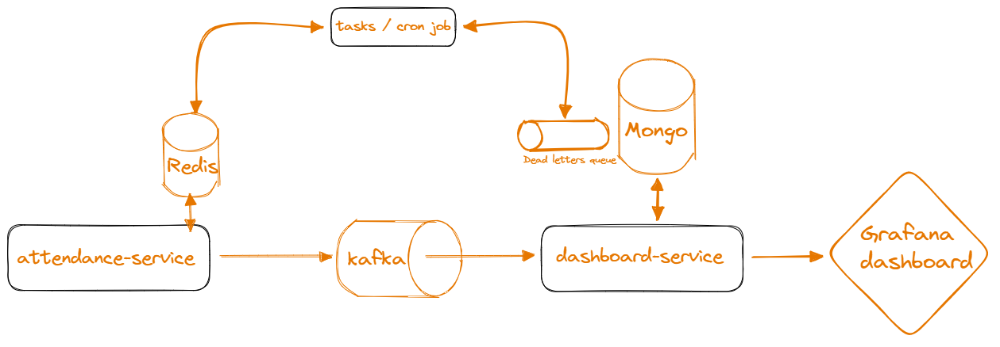

## Project structures

| Codebase                         |     Description           |
| :--------------------------------| :-----------------------: |
| [attendance](attendance-service) |  Attendance service       |
| [dashboard](dashboard-service)   |  Dashboard service        |
| [tasks](tasks)                   |  Background/Cron jobs     |
| [grafana](grafana)               |  Grafana dashboard        |
| [scripts](scripts)               |  Seeding, Benchmarking    |


## Setup & Run
> Prerequisites: Docker, Docker Compose, NodeJS npm/yarn

 - Build & start containers
```
$ docker compose up -d --build --remove-orphans
```
 - Seed database
```
$ cd scripts/
$ yarn install & yarn seed
```
 - Bench mark
```
$ cd scripts/
$ yarn benchmark
```
## Design process

*Requirement*: <br>
1000 schools, 10000 attendance records per school per day <br>
=> 10 millions records / day 

### Analyses:
 - Server capacity: ~ 1500 rps 
> Assume all 1000 schools are in the same timezone, which will result peak traffic at 2 period of time (check-in/check-out). <br>
> Each period last approx 1 hour so our server has to be able to handle 5 million reqs/hour ~ 1400 rps <br>
 - Write-heavy system.
 - Data of attendances is of type append-only.

### High level design
<p align="center">
  
</p>

### Demytify
 - Redis as a temporary storage for business logic purposes (e.g: check if users already checked in or not). It will be flushed everyday by `tasks`
 - Attendances records will be produced to kafka by `attendance-service` and then be consumed by `dashboard-service`
 - If consuming process goes wrong, records will be send to Dead Letter Queue (just a mongodb collection) for further processing.
 - There are 2 tasks: flush redis and process dead letter queue.

### Key Optimization:
 - Redis memory
> 10 millions records per day require quite a lot of Redis storage.<br>
> => Use hashmap to abstract  the key: <br>
> ```
> Using plain key-value: 
>       checkin:12345678  true
>       checkin:12345612  true
>       checkin:12345645  true
> Using hashmap:
>       checkin:123456  78  true
>                       12  true
>                       45  true
> ```            
> Using hashmap with some appropriate configurations result much lower storage cost. With 10 millions records, the first strategy will eat up ~ 1.6 GB, while the second result ~ 400 MB. <br>
> Implementation: [redis-repo.ts](./attendance-service/src/infra/redis-repo.ts)<br><br>
> Reference: [Redis Memory Optimization](https://redis.io/docs/management/optimization/memory-optimization)

 - Bulk pattern 
> Using bulk pattern to buffer and bulk write/publish can reduce the Round-trip cost.<br>
>  Usecases: use Redis Pipeline to perfom write, use Kafka batch to send messages.<br>  
> Implementation: [bulk.ts](./attendance-service/src/utils/bulk.ts)